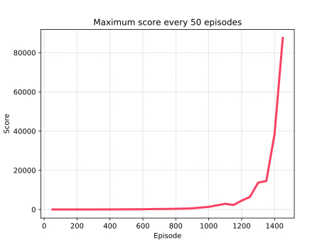

# Tetris

A bot that plays [tetris](https://en.wikipedia.org/wiki/Tetris) using deep reinforcement learning.

## Demo

First 10000 points, after some training.


## How does it work

#### Reinforcement Learning

At first, the agent will play random moves, saving the states and the given reward in a limited queue (replay memory). At the end of each episode (game), the agent will train itself (using a neural network) with a random sample of the replay memory. As more and more games are played, the agent becomes smarter, achieving higher and higher scores.

Since in reinforcement learning once an agent discovers a good 'path' it will stick with it, it was also considered an exploration variable (that decreases over time), so that the agent picks sometimes a random action instead of the one it considers the best. This way, it can discover new 'paths' to achieve higher scores.


#### Training

The training is based on the [Q Learning algorithm](https://en.wikipedia.org/wiki/Q-learning). Instead of using just the current state and reward obtained to train the network, it is used Q Learning (that considers the transition from the current state to the future one) to find out what is the best possible score of all the given states **considering the future rewards**, i.e., the algorithm is not greedy. This allows for the agent to take some moves that might not give an immediate reward, so it can get a bigger one later on (e.g. waiting to clear multiple lines instead of a single one).

The neural network will be updated with the given data (considering a play with reward *reward* that moves from *state* to *next_state*, the latter having an expected value of *Q_next_state*, found using the prediction from the neural network):

if not terminal state (last round): *Q_state* = *reward* + *discount* × *Q_next_state*
else: *Q_state* = *reward*

#### Game Score

Each block placed yields 1 point. When clearing lines, the given score is *number_lines_cleared*^2 × *board_width*. Losing a game subtracts 1 point.


## Implementation

All the code was implemented using `Python`. For the neural network, it was used the framework `Keras` with `Tensorflow` as backend.

#### Requirements

- Tensorflow/Jax/PyTorch
- Tensorboard
- Keras
- Opencv-python
- Numpy
- Pillow
- Tqdm

The original tests were evaluated using Keras with Tensorflow as the backend. However, using Jax as the backend appears to result faster training/predict operations.

## Run

- Train/execute:
```shell
# hyper parameters can be changed in the run.py script
python3 run.py
```

- View logs with `tensorboard`:
```shell
tensorboard --logdir ./logs
```


## Results

For 2000 episodes, with epsilon ending at 1500, the agent kept going for too long around episode 1460, so it had to be terminated. Here is a chart with the maximum score every 50 episodes, until episode 1450:



Note: Decreasing the `epsilon_end_episode` could make the agent achieve better results in a smaller number of episodes.
